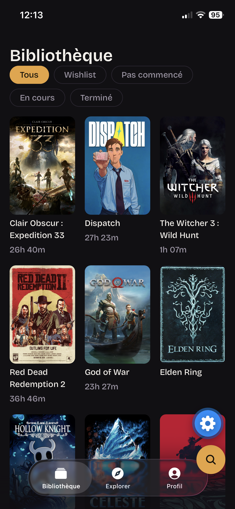
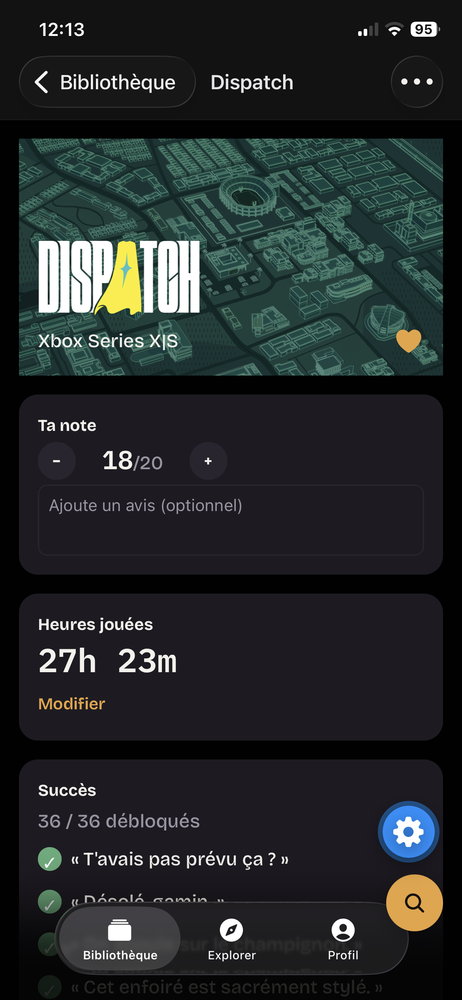
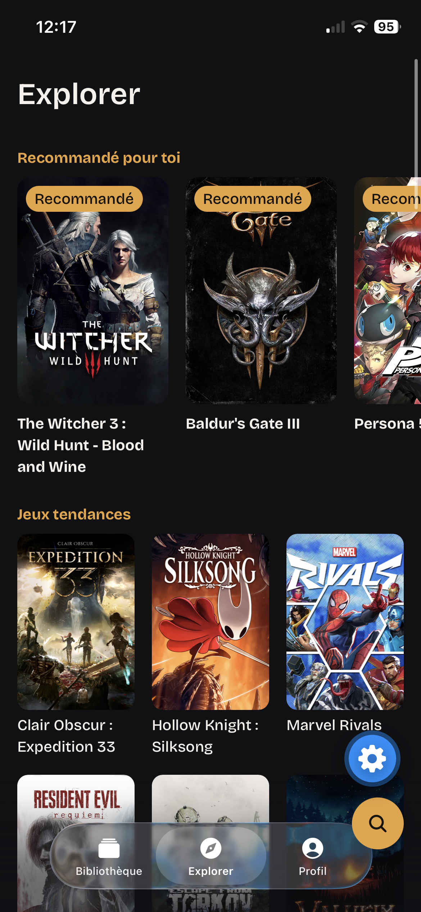
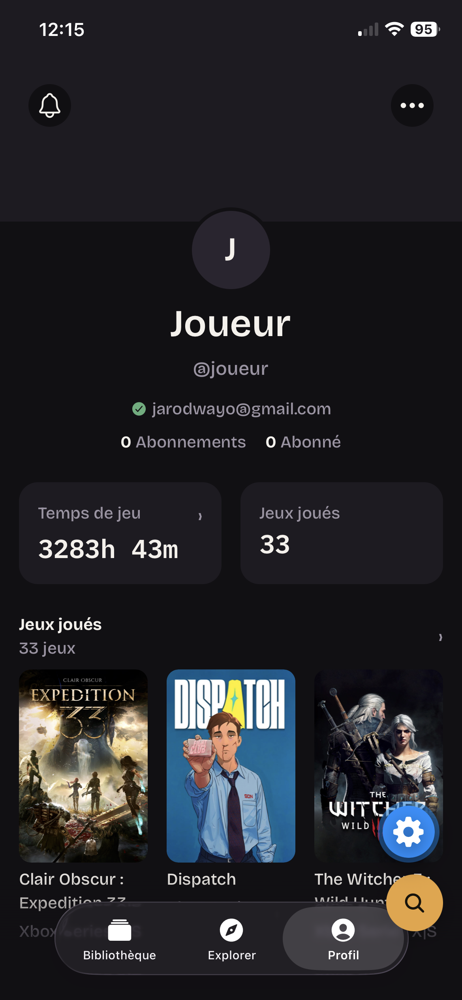
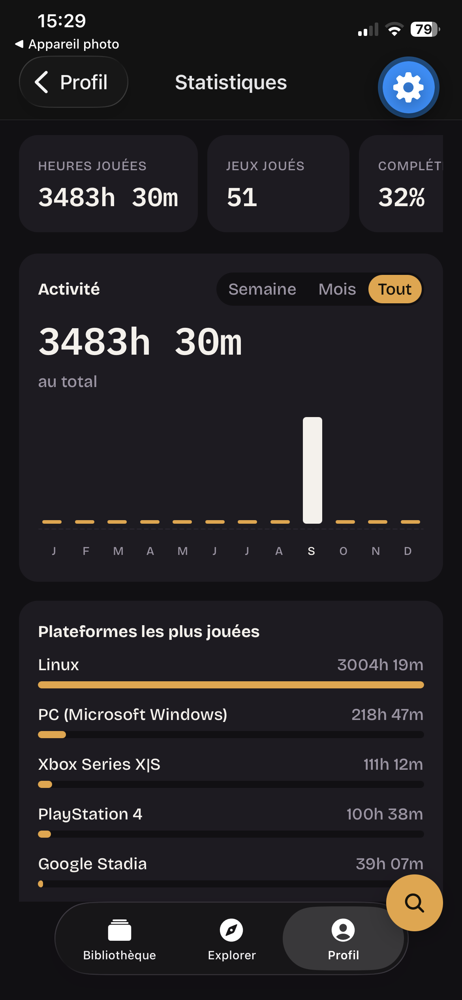
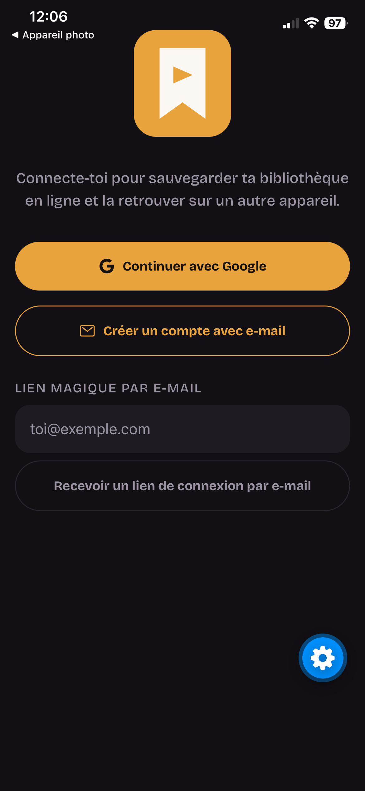

# Gamelary

🔗 **Démo en ligne** : [Essayer la démo](https://gamelary.expo.app) — *la version web est fournie à titre indicatif ; l'app est pensée mobile-first (iOS/Android) et l'expérience y est nettement meilleure.*

J'ai construit Gamelary pendant ma reconversion vers le métier de développeur
full stack (formation OpenClassrooms, complétée par des certifications
LinkedIn), pour sortir des exercices guidés et affronter les vrais problèmes
d'une app en production : gérer des secrets d'API sur plusieurs sources
externes (IGDB, Steam, SteamGridDB), faire cohabiter une bibliothèque locale
avec un compte utilisateur synchronisé, et tenir une vraie discipline de
tests (unitaires, E2E, mutation testing) plutôt que du code qui "marche chez
moi". Développé seul, du schéma de base de données jusqu'à l'interface
mobile et web.

Application mobile (iOS, Android, + web) façon **"Letterboxd pour les jeux vidéo"** :
bibliothèque de jeux suivis, wishlist, listes personnalisées, notes et avis,
suivi des succès, temps de jeu, et un onglet Explorer pour découvrir de
nouveaux titres.

Projet personnel, développé en solo — Expo (React Native) + TypeScript, avec
deux sources de données externes (IGDB pour le catalogue, Steam pour les
succès et le temps de jeu réel).

## Démo vidéo

**Connexion :**

[▶️ Voir la vidéo de connexion (~15 sec)]([https://youtu.be/2hxKEDNqP3M])

**Parcours complet (Bibliothèque → Explorer → Profil) :**

 [▶️ Voir la démo (~2 min)](https://youtu.be/1pkv3xvESzE)

## Captures d'écran

| | |
|---|---|
|  |  |
| **Bibliothèque** | **Fiche jeu** |
|  |  |
| **Explorer** | **Profil** |
|  |  |
| **Statistiques** | **Connexion** |

> ### 📐 [**ARCHITECTURE.md**](./ARCHITECTURE.md) — les décisions techniques et *pourquoi* elles ont été prises
> C'est le document principal du projet : choix de stack, gestion des
> secrets d'API, stratégie de cache par source de données, limites assumées
> et feuille de route. À lire en premier pour comprendre le raisonnement
> derrière le code.

---

## Fonctionnalités

- **Bibliothèque** — jeux suivis, wishlist, listes personnalisées, jeu "arrêté".
- **Fiche jeu** — note (0-20), avis, heures jouées, succès, musique préférée de la BO.
- **Succès** — saisie manuelle, ou **pré-remplissage depuis Steam** pour les jeux Steam liés.
- **Import de bibliothèque Steam** — récupère le temps de jeu réel et crée
  automatiquement dans le catalogue les jeux Steam encore inconnus de l'app
  (résolution inverse `app id Steam → IGDB`).
- **Explorer** — 5 rangées de découverte (recommandé, tendances, nouveautés,
  populaires, attendus), avec une rangée personnalisée selon la plateforme la
  plus jouée de la bibliothèque locale.
- **Statistiques** — temps de jeu par période, plateformes les plus jouées,
  jeux terminés à 100%.
- **Profil** — photo et arrière-plan personnalisés, nom/identifiant/bio,
  lien de profil partageable, créer une liste (nom, description,
  visibilité), et un réglage d'affichage de la fiche jeu (bandeau large +
  logo, ou jaquette portrait).
- **Comptes** — connexion **obligatoire** pour accéder à l'app, par Google
  OAuth, e-mail/mot de passe (avec réinitialisation), ou lien magique par
  e-mail (Supabase). La bibliothèque suivie et les succès sont
  **synchronisés entre appareils** (`user_games`, `achievements`) ; le
  temps de jeu par session (`play_sessions`) et les listes personnalisées
  restent pour l'instant propres à chaque appareil, pas encore
  synchronisés (voir [ARCHITECTURE.md §9](./ARCHITECTURE.md)).

## Stack

| | |
|---|---|
| **App** | Expo SDK 57 (React Native), TypeScript, `expo-router` (routing par fichiers) |
| **État local** | React Context + AsyncStorage — bibliothèque suivie/succès synchronisés via le compte (Supabase), temps de jeu par session et listes personnalisées propres à l'appareil |
| **Backend intégré** | Routes serveur `expo-router` (`src/app/api/*+api.ts`) — gardent les secrets IGDB/SteamGridDB hors du bundle client |
| **Backend séparé** | [**gamelary-api**](https://github.com/Jarodwayo/gamelary-api) — proxy Steam Web API (voir plus bas) |
| **Tests** | Jest (unitaire + routes serveur), Playwright (E2E), typecheck TypeScript, ESLint |
| **CI** | GitHub Actions — typecheck, lint, tests unitaires et E2E sur chaque push/PR |

## Architecture en un coup d'œil

```
                    ┌──────────────────────────────┐
   App Gamelary ────▶│ Routes serveur expo-router   │────▶ IGDB (catalogue, Explorer)
   (client mobile)   │ src/app/api/*+api.ts         │────▶ SteamGridDB (jaquettes)
        │            └──────────────────────────────┘
        │              secrets côté serveur uniquement
        │
        └───────────▶┌──────────────────────────────┐
                     │ gamelary-api (repo séparé)   │────▶ Steam Web API
                     │ Node/Express, déployé Render │      (succès, temps de jeu)
                     └──────────────────────────────┘
                       STEAM_API_KEY jamais exposée
```

**Pourquoi un backend Steam séparé plutôt qu'une route de plus dans l'app ?**
IGDB et SteamGridDB acceptent leur clé dans un en-tête HTTP, ce que le système
d'identifiants managés du projet sait injecter. La Steam Web API, elle,
n'accepte la clé **que** comme paramètre d'URL (`?key=...`) — incompatible avec
ce système. D'où un petit service Express indépendant qui construit l'URL
lui-même et garde la clé dans une variable d'environnement classique. Le
raisonnement complet est dans [ARCHITECTURE.md §6.3 et §7](./ARCHITECTURE.md).

## Démarrer

### Prérequis

- Node.js 22+
- Un simulateur iOS / émulateur Android, ou simplement un navigateur pour la version web

### Installation

```bash
npm install
npm run web       # version web dans le navigateur (le plus rapide pour tester)
# ou
npm start         # QR code Expo Go / choix du simulateur
npm run ios       # simulateur iOS
npm run android   # émulateur Android
```

La connexion (Google, e-mail/mot de passe ou lien magique, voir
[ARCHITECTURE.md §9.7](./ARCHITECTURE.md)) est désormais **obligatoire**
pour accéder aux onglets : `EXPO_PUBLIC_SUPABASE_URL`
et `EXPO_PUBLIC_SUPABASE_ANON_KEY` sont donc les deux seules variables
réellement indispensables pour utiliser l'app — sans elles, l'écran de
connexion reste bloqué en permanence (message explicite, pas d'écran
d'erreur brut). Les autres clés ci-dessous restent optionnelles, avec des
replis explicites une fois connecté : les jaquettes tombent sur un
placeholder, les rangées Explorer restent vides, et les fonctionnalités
Steam sont simplement masquées.

### Variables d'environnement

Créer un fichier `.env` à la racine (voir [`.env.example`](.env.example)) :

| Variable | Rôle | Où l'obtenir |
|---|---|---|
| `IGDB_CLIENT_ID` | Catalogue de jeux (titres, plateformes, Explorer) | [Twitch Developer Console](https://dev.twitch.tv/console/apps) — IGDB utilise l'auth Twitch |
| `IGDB_ACCESS_TOKEN` | idem (token OAuth Client Credentials, ~60 jours) | Échange `client_id`/`client_secret` via l'API Twitch |
| `STEAMGRIDDB_API_KEY` | Jaquettes de jeux | [steamgriddb.com/profile/preferences/api](https://www.steamgriddb.com/profile/preferences/api) |
| `EXPO_PUBLIC_STEAM_API_URL` | URL du backend Steam déployé (succès + temps de jeu) | Fournie par ton déploiement de [gamelary-api](https://github.com/Jarodwayo/gamelary-api) |
| `EXPO_PUBLIC_API_URL` | URL des routes API de Gamelary (`/api/games`, `/api/cover`) pour un build **natif de production** — inutile en dev et sur le web | L'hébergeur Node qui sert l'app (voir `src/lib/api-url.ts`) |
| `EXPO_PUBLIC_PROFILE_BASE_URL` | Domaine des liens de profil partagés (`/u/<identifiant>`) — facultatif | Ton domaine public ; à défaut, le lien retombe sur l'URL de l'app |
| `EXPO_PUBLIC_SUPABASE_URL` | Comptes (Google OAuth + e-mail, voir ARCHITECTURE.md §9) | Project Settings > API, sur [ton projet Supabase](https://supabase.com/dashboard) |
| `EXPO_PUBLIC_SUPABASE_ANON_KEY` | idem — clé "anon public", pas "service_role" | idem |
| `EXPO_PUBLIC_SUPPORT_EMAIL` | Adresse de "Contacter l'assistance" (Aide et idées) — facultatif | La tienne ; absente, vide ou mal formée, la ligne ouvre une issue GitHub |

⚠️ Seules les variables préfixées `EXPO_PUBLIC_` finissent dans le bundle
client — elles ne doivent donc **jamais** contenir de secret (ici, seulement
des URL publiques). Les trois autres sont lues uniquement côté serveur, par les
routes `+api.ts`.

## Tests et qualité

```bash
npm test            # Jest — logique métier, routes serveur, store
npm run test:e2e    # Playwright — parcours E2E (démarre le serveur web automatiquement)
npm run lint        # ESLint (config Expo)
npx tsc --noEmit    # Typecheck TypeScript
```

Ces quatre commandes tournent aussi en CI (job `checks`) sur chaque push et
chaque pull request — `main` est protégé et refuse un merge si l'une échoue.

Les tests E2E mockent les appels réseau externes (`page.route`) : aucun test ne
dépend d'une vraie clé d'API ni d'un service distant.

## État du projet

Projet actif, développé en itérations. Les fonctionnalités implémentées, celles
prévues, et les limites volontairement assumées (cache en mémoire côté serveur,
temps de jeu et listes personnalisées pas encore synchronisés entre appareils)
sont listées et justifiées dans [ARCHITECTURE.md §9](./ARCHITECTURE.md) et
[§10](./ARCHITECTURE.md).

## Licence

Dépôt public à des fins de démonstration, **sans licence open source** :
le code est consultable mais pas réutilisable sans autorisation (voir
[`LICENSE`](./LICENSE)).
